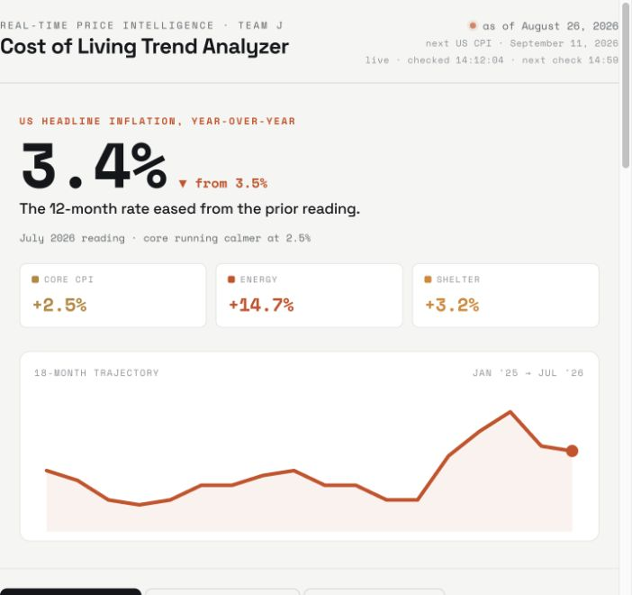
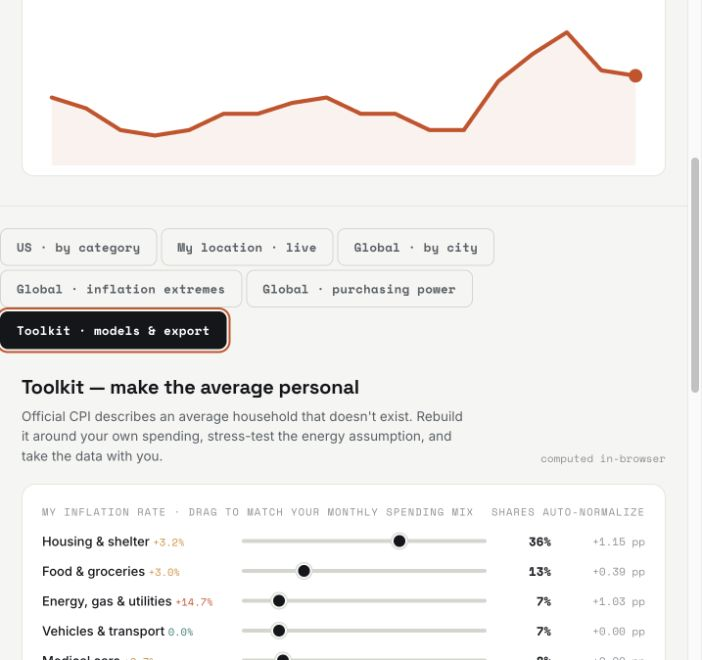

# Cost of Living Trend Analyzer

An interactive dashboard for exploring U.S. inflation, city-level cost comparisons, global inflation, purchasing power, and household-specific price pressure.

[View the live dashboard](https://jamespaek1.github.io/cost-of-living-trend-analyzer/) · [Open the dashboard file](index.html)



## Project overview

I built this project for the TKH × Bloomberg Hackathon to make cost-of-living data easier to interpret. It combines official economic data with interactive comparisons, a lightweight forecasting model, and tools that let users explore how national inflation may differ from their own spending experience.

## What it does

- Tracks U.S. headline, core, energy, shelter, and category-level inflation.
- Visualizes an 18-month trend with a damped-trend forecast and uncertainty band.
- Loads inflation, GNI per capita, and purchasing-power data for World Bank economies.
- Compares costs and estimated pay equivalence across 14 cities.
- Includes a personal inflation calculator and energy-price scenario tool.
- Exports trend, category, city, and country data as CSV.
- Runs as a static site with no backend or build step.

## Outcomes

The result is a deployable dashboard with six analytical views, 14 city comparisons, 11 metro comparisons, World Bank country lookups, shareable location URLs, and downloadable data. It helps users distinguish headline inflation from the mix of price changes that affects their own household.



## My contribution

This repository contains my implementation work for Team J’s TKH × Bloomberg Hackathon project. I built the interactive dashboard, data-refresh script, visualizations, damped-trend forecast, personal-inflation and scenario tools, CSV export, World Bank integration, and scheduled GitHub Actions workflow.

## Technology

- HTML, CSS, and JavaScript
- Python standard library
- SVG-based data visualization
- GitHub Actions and GitHub Pages
- BLS and World Bank public APIs

## Run locally

```bash
python -m http.server 8000
```

Open `http://localhost:8000/`.

## Refresh the data

```bash
python fetch_cost_of_living.py
```

The script uses the keyless BLS and World Bank public APIs and generates `data.js`. Reload the dashboard to use the refreshed data.

## Data sources

| Data | Source | Update frequency |
|---|---|---|
| U.S. CPI | [U.S. Bureau of Labor Statistics](https://www.bls.gov/cpi/) | Monthly |
| Country inflation | [World Bank: FP.CPI.TOTL.ZG](https://data.worldbank.org/indicator/FP.CPI.TOTL.ZG) | Annual |
| GNI per capita, PPP | [World Bank: NY.GNP.PCAP.PP.CD](https://data.worldbank.org/indicator/NY.GNP.PCAP.PP.CD) | Annual |
| Price-level ratio | [World Bank: PA.NUS.PPPC.RF](https://data.worldbank.org/indicator/PA.NUS.PPPC.RF) | Annual |
| City cost indices | [Numbeo Cost of Living Index](https://www.numbeo.com/cost-of-living/rankings.jsp) | Curated snapshot |
| Forecast fallbacks | [IMF World Economic Outlook](https://www.imf.org/en/Publications/WEO/weo-database/) | Semiannual |

## Limitations

- Country-level World Bank series are annual and may lag the current calendar year.
- City cost, wage, and metro figures are curated snapshots, not real-time feeds.
- The forecast is a momentum-based explanatory model, not financial advice or a causal forecast.
- The scheduled refresh updates official national CPI and World Bank data; curated city and metro snapshots require manual review.
